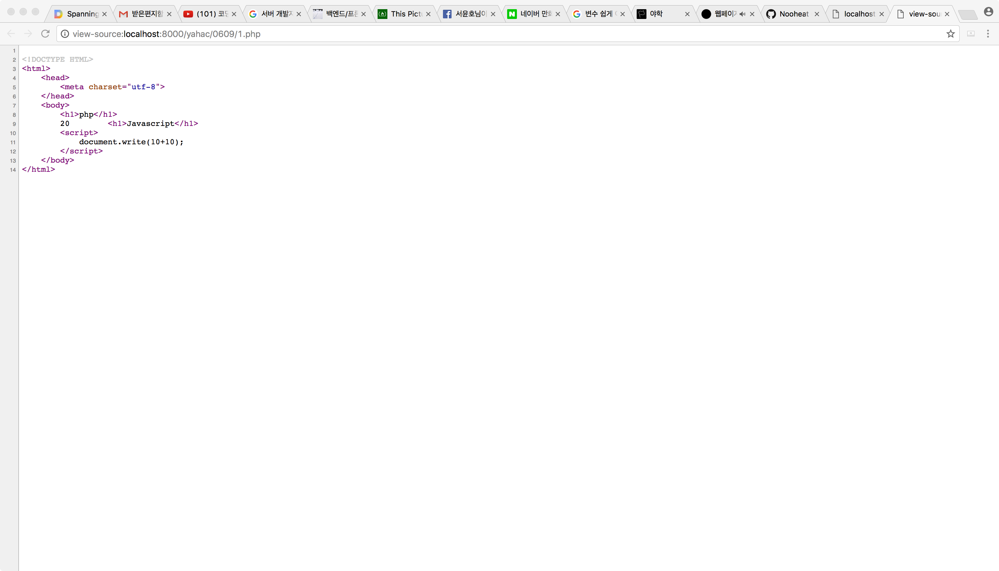

# 0609 (~웹페이지에 코드 삽입하기)

## 복습과 수업 예고

웹서버 : PHP & 데이터베이스(설치해야하는 소프트웨어)작동 모델  
1) 웹브라우저 → 웹서버 : http://a.com/a.php (a.php 파일 요청)  
2) 웹서버 : a.php에서 ‘.php’를 인식 → php엔진(인터프리터)에 파일 처리명령  
3) 설치된 PHP : a.php 파일을 읽고 해석  
```
<?php“데이터베이스 topic에서 수업제목들을 가져온다.”?> : 태그를 만날 경우 php 문법에 따라 해석  
```
4) PHP → 데이터베이스 : <?php"내용"?> 태그의 내용부분을 데이터베이스에 요청  
예) 데이터베이스의 topic이라는 테이블의 수업제목을 요청  
5) 데이터베이스 → PHP : 요청된 데이터를 php엔진에 돌려 줌  
__a.php 파일 내 <?php'내용'?>과 데이터베이스 테이블 내용을 결합하여
테이블 내용을 html 형식으로 해석__  
6) 완성된html파일 → 웹서버 : php & 데이터베이스에의해 완성된 html정보를 웹서버에 전달  
7) 웹서버 → 웹브라우저 : 완성된html파일 웹브라우저에 전송  
8) 웹브라우저 : 완성된html파일 코드를 해석해 웹브라우저 화면에 출력  
  
출처 : [https://opentutorials.org/course/1688/9364](https://opentutorials.org/course/1688/9364) 댓글 GIMYO님  


## Javascript vs PHP
HTML & CSS : 정적인 언어이기 때문에 한 번 표시되면 내용을 변경할 수 없음  
Javascript & PHP : 동적인 언어이기 때문에 동작을 감지해 내용을 변경할 수 있음  
  
Javascript : 사용자 요청에 따라 웹브라우저에 명령을 내릴 수 있는 언어  
ex) '버튼이 클릭되면 화면을 검은색으로 바꾸어라.'  
  
PHP : HTML 문서 내의 태그와 '정보'를 분리해 관리할 수 있는 방법  
하나의 php 파일로 여러 페이지를 작성할 수 있음  


## 웹페이지에 코드 삽입하기

**1.php**

```
<!DOCTYPE HTML>
<html>
    <head>
        <meta charset="utf-8">
    </head>
    <body>
        <h1>php</h1>
        <?php
            echo 10+10;
        ?>
        <h1>Javascript</h1>
        <script>
            document.write(10+10);
        </script>
    </body>
</html>
```

**실행 결과 :**  
  
실행 결과는 20으로 같다.  
  
**페이지 소스 비교**  
  
php코드는 보이지 않고 javascript의 코드만 볼 수 있다.  
  
*이는 php 인터프리터가 소스코드를 해석한 결과를 웹서버에 전달하기 때문이다.*  
*따라서 보안이 필요한 경우에는 php와 같은 서버 기술을 사용해 은닉해야 한다.*  


